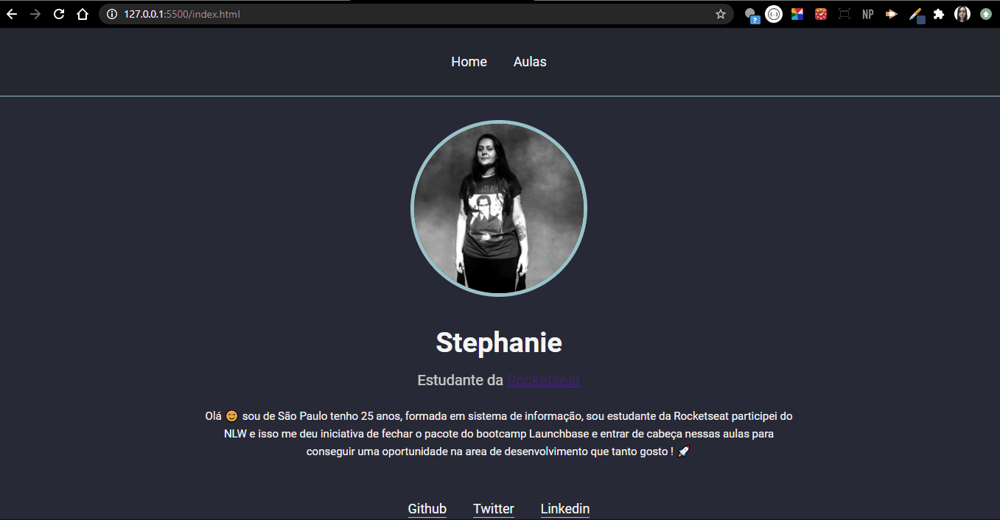

<h2 align="center">
    
     
    <b> Desafio Módulo 2 - Iniciando no Front-end</b> 
     
</h2>

---

## 📋 Índice

- [Sobre](#sobre)
- [Desafio Iniciando no Front-end](#front)

---

## 🔖 Sobre

Esse desafio e para conhecermos os primeiros passos do front-end, tendo como intuito mostrar o poder do CSS e HTML juntamente do JavaScript. 🚀

---

## 🚀 Resultado do desafio 

---

<h5 align="center">
    Feito com 💜 por <a href="https://www.linkedin.com/in/stephanie-nascimento-71ab51152/" target="_blank">Stephanie Nascimento</a> no bootcamp da <a href="https://rocketseat.com.br/" target="_blank">Rocketseat</a> 🚀
</h5>